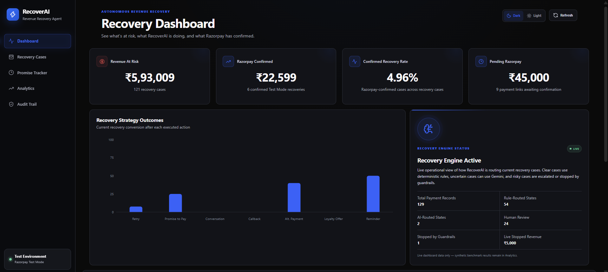
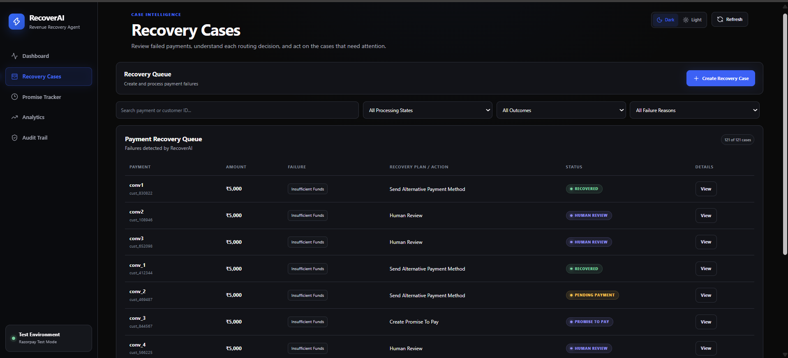
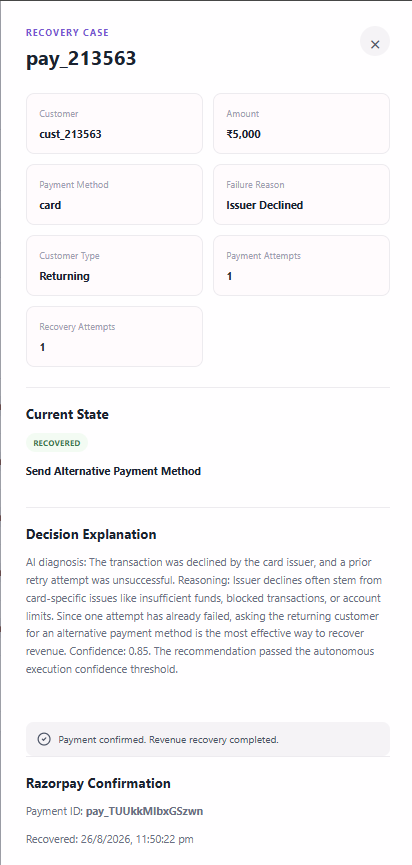
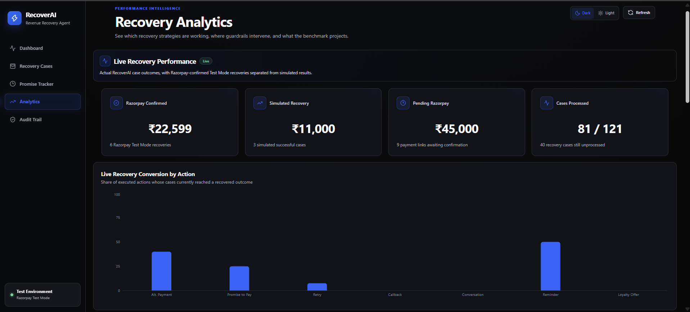
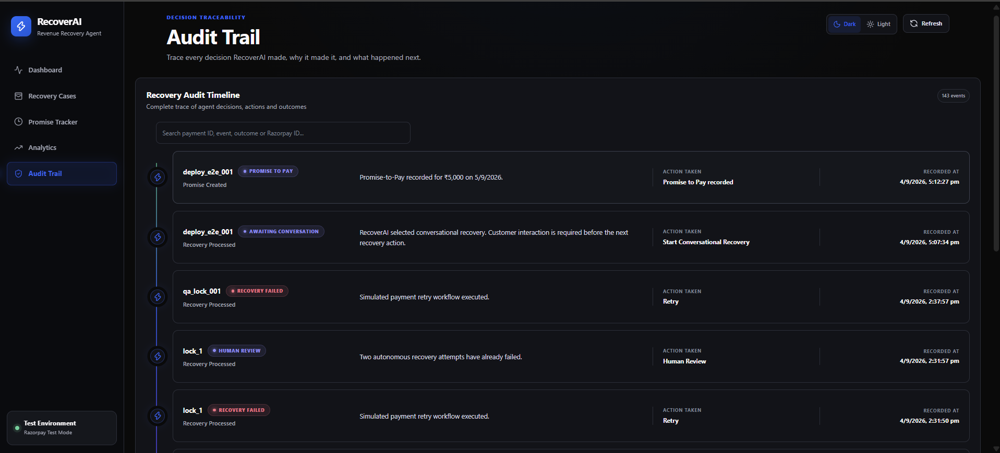

# RecoverAI

**Autonomous Revenue Recovery Agent for Failed Payments**

RecoverAI is an AI-assisted revenue recovery system built for the **Razorpay AI Buildathon – Revenue Recovery track**.

It detects failed or abandoned payments, selects an appropriate recovery strategy, applies policy guardrails, executes bounded recovery actions, tracks outcomes, and measures recovery performance.

The system combines deterministic business rules with Gemini-based reasoning for uncertain payment failures and integrates with Razorpay Test Mode for recovery payment links and webhook-confirmed payment recovery.

---

## Live Demo

### Frontend
https://recover-ai-nu-pink.vercel.app/

### Backend
https://recoverai-backend-fj9o.onrender.com/

---

## Problem

Failed and abandoned payments directly translate into lost revenue.

Traditional recovery systems often use the same retry or reminder strategy for every failed transaction, even though payment failures can occur for very different reasons.

Examples include:

- temporary timeout
- insufficient funds
- checkout abandonment
- issuer decline
- bank restriction
- repeated failed attempts

Using the wrong intervention can reduce recovery chances or repeatedly disturb the customer.

RecoverAI addresses this by choosing a recovery action based on payment context, confidence, previous attempts, and safety policies.

---

## How RecoverAI Works

RecoverAI uses a hybrid recovery pipeline that combines deterministic rules, AI reasoning, safety checks, and outcome tracking.

```text
Payment Failure
      ↓
Failure Detection
      ↓
Deterministic Rule Engine
      ↓
Known Failure?
   ↙       ↘
 Yes       No
  ↓         ↓
Rule      Gemini AI
Action    Analysis
   ↘       ↙
  Policy & Guardrails
          ↓
  Recovery Execution
          ↓
   Outcome Tracking
          ↓
 Audit Trail + Analytics
```

The agent follows a bounded decision cycle:

```text
Observe → Diagnose → Decide → Validate → Execute → Observe Result → Update State
```

---

## Recovery Strategies

RecoverAI supports multiple recovery actions depending on the payment failure and customer context.

| Recovery Action | Purpose |
|---|---|
| `RETRY` | Retry a temporary payment failure |
| `REMIND_LATER` | Schedule a later recovery attempt |
| `SEND_REMINDER` | Trigger a simulated checkout recovery reminder |
| `SEND_ALTERNATIVE_PAYMENT_METHOD` | Create a Razorpay Test Mode Payment Link |
| `OFFER_LOYALTY_INCENTIVE` | Trigger a simulated loyalty-based recovery workflow |
| `HUMAN_REVIEW` | Escalate uncertain or repeatedly failed cases |
| `STOP_RECOVERY` | Stop further automated intervention |

Retry, reminder, and loyalty workflows are simulated for evaluation.

`SEND_ALTERNATIVE_PAYMENT_METHOD` is integrated with **Razorpay Test Mode** and creates an actual payment link that can be completed during testing.

---

## Decision Engine

RecoverAI uses a **hybrid decision architecture**.

### Deterministic Rules

Known payment failures are handled using predefined recovery rules without requiring an AI call.

Examples:

```text
timeout
→ RETRY

insufficient_funds
→ REMIND_LATER

checkout_abandoned + new customer
→ SEND_REMINDER

checkout_abandoned + returning customer
→ OFFER_LOYALTY_INCENTIVE

attemptCount >= 3
→ STOP_RECOVERY
```

This makes common recovery decisions fast, predictable, and inexpensive.

### Gemini AI Reasoning

When the deterministic engine cannot confidently classify a failure, RecoverAI routes the case to Gemini.

Gemini analyzes payment context including:

- failure reason
- payment method
- customer type
- payment amount
- previous payment attempts

The AI returns:

```text
diagnosis
recommendedAction
confidence
reasoning
```

RecoverAI does not directly trust and execute every AI recommendation. The recommendation must first pass confidence checks and policy guardrails before autonomous execution is allowed.

---

## Confidence Gating & Guardrails

RecoverAI uses safety controls to prevent uncertain or excessive autonomous recovery actions.

### AI Confidence Threshold

AI-driven actions require a confidence score of at least:

```text
0.75
```

If the AI confidence is below the threshold, the case is escalated to:

```text
HUMAN_REVIEW
```

No autonomous recovery action is executed for that case.

### Maximum Autonomous Recovery Attempts

RecoverAI allows a maximum of **2 autonomous recovery attempts**.

If both attempts fail:

```text
RECOVERY_FAILED
       ↓
HUMAN_REVIEW
```

The escalation itself does not increase the recovery-attempt counter.

### Payment Attempt Hard Stop

If the original payment already has:

```text
attemptCount >= 3
```

RecoverAI selects:

```text
STOP_RECOVERY
```

without attempting another recovery action.

### Protected States

Cases in the following states cannot be processed again automatically:

```text
RECOVERED
STOPPED
PENDING_PAYMENT
HUMAN_REVIEW
```

These guardrails keep the agent bounded and prevent repeated or unsafe automated actions.

---

## Razorpay Recovery Flow

For eligible recovery cases, RecoverAI can create a real **Razorpay Test Mode Payment Link**.

```text
AI / Rule Decision
        ↓
SEND_ALTERNATIVE_PAYMENT_METHOD
        ↓
Create Razorpay Payment Link
        ↓
PENDING_PAYMENT
        ↓
Customer Completes Payment
        ↓
Razorpay payment_link.paid Webhook
        ↓
Webhook Signature Verification
        ↓
RECOVERED
```

A case is counted as Razorpay-confirmed recovered revenue **only after the payment is completed and the signed webhook is successfully received**.

Creating a payment link alone does not count as recovered revenue.

### Webhook Security

Incoming Razorpay webhook requests are verified before any recovery state is modified.

The webhook flow includes:

- raw request-body handling
- HMAC SHA-256 signature verification
- payment-link matching
- idempotency protection
- automatic recovery-state update
- webhook audit logging

Duplicate webhook deliveries cannot mark the same recovery case as recovered multiple times.

---

## Recovery States

RecoverAI stores the lifecycle of each processed recovery case in MongoDB Atlas.

The main recovery states are:

```text
NOT_PROCESSED
RECOVERY_FAILED
PENDING_PAYMENT
RECOVERED
HUMAN_REVIEW
STOPPED
```

Each recovery state can store information such as:

- payment ID
- selected recovery action
- current outcome
- number of recovery attempts
- decision explanation
- Razorpay Payment Link ID and URL
- Razorpay Payment ID
- processing timestamp
- recovery timestamp

This persistent state allows RecoverAI to track a payment across multiple recovery attempts and prevents terminal or pending cases from being processed incorrectly.

---

## Analytics & Evaluation

RecoverAI separates **live recovery evidence** from **synthetic benchmark results** so simulated outcomes are not presented as real recovered revenue.

### Live Recovery Analytics

The dashboard tracks actual cases processed through the RecoverAI agent, including:

- revenue at risk
- recovered revenue
- recovered cases
- recovery rate
- pending Razorpay payments
- human-review cases
- stopped recoveries
- recovery strategy performance
- recent recovery activity

Razorpay Test Mode payments confirmed through the webhook are tracked separately from simulated recovery outcomes.

### Safe Synthetic Benchmark

RecoverAI includes a fixed dataset of **50 synthetic payments** for evaluating the recovery engine.

The benchmark currently contains:

```text
50 synthetic payments
42 recovery cases
```

The batch evaluation is intentionally side-effect free:

```text
0 Gemini API calls
0 Razorpay Payment Links created
0 recovery-state mutations
0 audit-log mutations
```

Latest fixed benchmark results:

```text
Revenue at risk: ₹2,33,600
Recoverable cases: 37
Projected recovered cases: 18
Projected recovered revenue: ₹96,000
Projected recovery rate: 42.86%
Human review cases: 1
Stopped cases: 4
```

These figures are **synthetic projected results** and are not claims about real-world merchant recovery performance.

Razorpay-confirmed Test Mode recoveries are reported separately.

---

## Audit Trail

Every processed recovery decision is recorded in the audit trail.

Audit records capture information such as:

- payment ID
- selected strategy
- decision reasoning
- execution result
- recovery outcome
- timestamps

Razorpay payment confirmations are also recorded as webhook audit events.

This provides traceability across the autonomous recovery lifecycle.

---

## Dashboard Features

### Dashboard

- revenue at risk
- recovered revenue
- recovery rate
- pending payments
- strategy performance
- recent recovery activity
- agent status

### Recovery Cases

- create test recovery cases
- search by payment or customer ID
- filter by outcome
- filter by failure reason
- inspect agent decisions
- view payment and recovery attempts
- manually run eligible recovery cases
- open Razorpay recovery links
- monitor webhook-driven status updates

### Analytics

- live strategy performance
- Razorpay-confirmed recoveries
- simulated recovery results
- pending recovery revenue
- safe 50-payment benchmark
- guardrail outcomes
- rule-vs-AI routing
- projected strategy performance

### Audit Trail

- recovery decisions
- execution events
- payment confirmation events
- timestamps and outcomes

---


---

## Screenshots

### Dashboard



### Recovery Cases



### AI Decision and Razorpay-Confirmed Recovery



### Analytics



### Audit Trail




## Tech Stack

### Frontend

- React
- Vite
- JavaScript
- Axios
- Recharts
- Lucide React
- CSS

### Backend

- Node.js
- Express.js
- MongoDB Node Driver
- Express Rate Limit
- CORS

### AI

- Google Gemini
- `@google/genai`
- Gemini 3.6 Flash

### Payments

- Razorpay Test Mode
- Razorpay Payment Links
- Razorpay Webhooks
- HMAC webhook verification

### Database

- MongoDB Atlas

### Deployment

- Vercel — frontend
- Render — backend
- MongoDB Atlas — database

---

## Architecture



---

## Project Structure

```text
RecoverAI/
│
├── backend/
│   ├── data/
│   │   └── payments.json
│   │
│   ├── services/
│   │   ├── actionExecutor.js
│   │   ├── aiRecoveryService.js
│   │   ├── auditService.js
│   │   ├── batchEvaluationService.js
│   │   ├── paymentService.js
│   │   ├── policyEngine.js
│   │   ├── razorpayService.js
│   │   ├── recoveryAnalytics.js
│   │   ├── recoveryEngine.js
│   │   ├── recoverySimulator.js
│   │   ├── recoveryStateService.js
│   │   ├── singleRecoveryService.js
│   │   └── webhookService.js
│   │
│   ├── .env.example
│   ├── db.js
│   ├── server.js
│   └── package.json
│
├── frontend/
│   ├── src/
│   │   ├── App.jsx
│   │   ├── App.css
│   │   └── main.jsx
│   │
│   └── package.json
│
├── .gitignore
└── README.md
```

---

## Environment Variables

Create:

```text
backend/.env
```

using:

```env
MONGO_URI=your_mongodb_atlas_connection_string

GEMINI_API_KEY=your_gemini_api_key

RAZORPAY_KEY_ID=your_razorpay_test_key_id
RAZORPAY_KEY_SECRET=your_razorpay_test_key_secret
RAZORPAY_WEBHOOK_SECRET=your_razorpay_webhook_secret

NODE_ENV=development
PORT=5000
```

For the deployed frontend environment:

```env
VITE_API_URL=https://your-backend-domain
```

Never commit the real `.env` file.

---

## Local Setup

Clone the repository:

```bash
git clone https://github.com/Yash-tech25/RecoverAI.git
```

Enter the project:

```bash
cd RecoverAI
```

Install backend dependencies:

```bash
cd backend
npm install
```

Create the backend `.env` file using `.env.example` as a reference.

Start the backend:

```bash
npm start
```

Open another terminal and install frontend dependencies:

```bash
cd frontend
npm install
```

Start the frontend:

```bash
npm run dev
```

The frontend runs locally at:

```text
http://localhost:5173
```

The backend defaults to:

```text
http://localhost:5000
```

---

## Safety Measures

RecoverAI includes safeguards appropriate for a bounded autonomous financial workflow:

- bounded autonomous recovery attempts
- confidence-gated AI execution
- human escalation
- payment-attempt stopping rules
- policy validation before execution
- protected pending and terminal states
- webhook signature verification
- webhook idempotency
- API rate limiting
- server-side payment validation
- disabled live bulk-recovery behavior
- safe side-effect-free batch evaluation
- separation of simulated and Razorpay-confirmed recovery results

---

## Important Evaluation Note

RecoverAI uses synthetic payment-failure data for testing and benchmark evaluation.

Razorpay **Test Mode** transactions are used to validate:

- payment-link creation
- payment completion
- signed webhook handling
- automatic recovery-state transition

No actual merchant funds are transferred.

The reported synthetic recovery rate is a deterministic benchmark projection and should not be interpreted as production merchant performance.

---

## Future Improvements

Possible future extensions include:

- real SMS and email reminder integrations
- merchant-specific recovery policy configuration
- learned recovery strategy optimization
- event-driven payment ingestion
- Redis-backed distributed recovery locks
- transactional audit and state updates
- authentication and role-based access
- production payment processor integrations
- strategy experimentation and A/B testing

---

## Buildathon Track

**Razorpay AI Buildathon**

**Track: Revenue Recovery**

RecoverAI demonstrates how bounded AI reasoning, deterministic business rules, payment infrastructure, safety guardrails, and measurable recovery outcomes can work together in a practical revenue-recovery agent.
