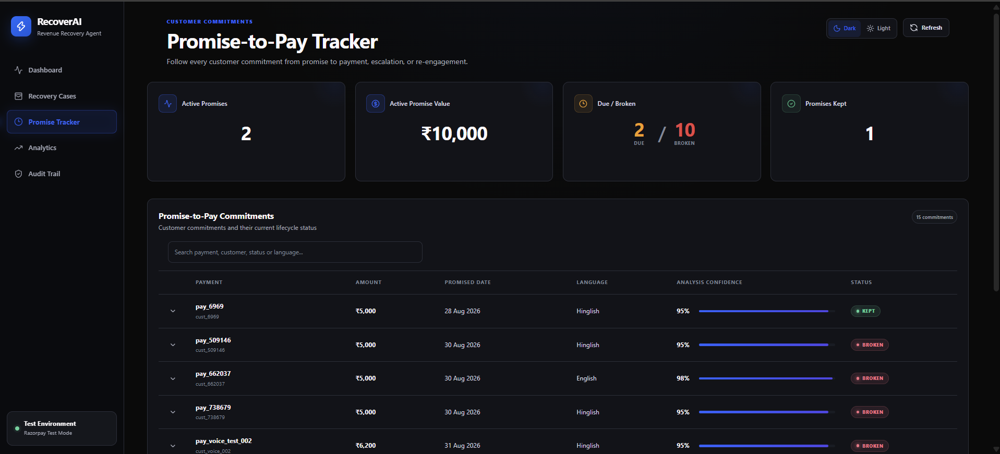

# RecoverAI

**Bounded, multi-channel agentic revenue recovery for failed payments**

RecoverAI is an AI-assisted revenue recovery system built for the **Razorpay AI Buildathon — Revenue Recovery track**.

Instead of applying the same retry strategy to every failed payment, RecoverAI uses payment context, deterministic rules, Gemini-assisted reasoning, safety guardrails, persistent state, conversational recovery, Promise-to-Pay tracking, and Razorpay Test Mode payment recovery to decide what should happen next.

> **Core loop:** Observe → Diagnose → Route → Guard → Act → Observe outcome/time → Persist state → Continue, escalate, or stop

---

## Live Demo

### Frontend

https://recover-ai-nu-pink.vercel.app/

### Backend

https://recoverai-backend-fj9o.onrender.com/

### GitHub

https://github.com/Yash-tech25/RecoverAI

---

## Problem

Failed and abandoned payments directly translate into revenue at risk.

Traditional recovery systems often apply the same retry or reminder strategy to every failed transaction, even though payment failures can happen for very different reasons.

Examples include:

- temporary timeout
- insufficient funds
- checkout abandonment
- issuer decline
- bank restriction
- repeated failed attempts
- unclear processor responses

Using the wrong intervention can reduce recovery chances, waste recovery attempts, or repeatedly disturb the customer.

RecoverAI addresses this by choosing the recovery path based on payment context, confidence, previous attempts, customer response, and safety policies.

---

## Why RecoverAI

RecoverAI is designed as a **bounded multi-channel recovery agent**.

Instead of treating recovery as a single decision, it separates the workflow into distinct stages:

1. **Channel routing** — should this case use payment recovery, conversational recovery, human review, or stop?
2. **Action selection** — what specific recovery action is appropriate inside that channel?
3. **Execution safety** — is the action allowed under confidence thresholds, state protection, attempt limits, and policy checks?
4. **Outcome tracking** — what happened after the action?
5. **State continuation** — should the system continue, wait, escalate, or stop?
6. **Auditability** — what did the system decide, why, and when?

This separation keeps the recovery agent explainable and bounded.

---

## How RecoverAI Works

RecoverAI follows a persistent recovery loop:

```text
Observe
  ↓
Diagnose
  ↓
Route
  ↓
Apply Guardrails
  ↓
Act
  ↓
Observe Outcome / Customer Commitment / Time
  ↓
Persist State
  ↓
Continue / Escalate / Stop
```

The system combines deterministic routing, AI-assisted reasoning, policy guardrails, payment infrastructure, customer conversation analysis, persistent recovery state, Promise-to-Pay lifecycle tracking, and auditability.

---

## Architecture


Editable Mermaid source:

[`docs/architecture.mmd`](docs/architecture.mmd)

### Architecture Summary

```text
React + Vite Frontend
        ↓
Node.js + Express Backend
        ↓
Recovery Orchestrator
        ↓
Deterministic Channel Router
   ↙          ↓           ↘
Payment   Conversation   Stop
   ↘          ↓
     Gemini AI Router
     for ambiguous cases
            ↓
Confidence + Policy Guardrails
       ↙                ↘
Payment Recovery    Human Review
       ↓
Action Selection + Execution
       ↓
Razorpay Test Mode / MongoDB State
       ↓
Webhook Confirmation
       ↓
Audit Trail + Analytics
```

Conversational recovery operates as a separate bounded path:

```text
Conversational Recovery
        ↓
Gemini Conversation Analysis
        ↓
Intent Classification
        ↓
Promise-to-Pay / Callback / Payment Verification / Human Review
        ↓
Persistent State + Audit Trail
```

---

## Recovery Channels

RecoverAI first determines the safest recovery **channel**.

| Channel | Purpose |
|---|---|
| `PAYMENT_RECOVERY` | Execute or recommend a payment-focused recovery action |
| `CONVERSATIONAL_RECOVERY` | Ask for customer context and convert the response into a bounded next action |
| `HUMAN_REVIEW` | Escalate uncertain, sensitive, or low-confidence cases |
| `STOP_RECOVERY` | Prevent further automated recovery |

---

## Deterministic Channel Routing

Known payment situations are handled using deterministic rules before any AI routing is considered.

Examples:

```text
success
→ STOP_RECOVERY

attemptCount >= 3
→ STOP_RECOVERY

timeout
→ PAYMENT_RECOVERY

insufficient_funds
→ CONVERSATIONAL_RECOVERY

checkout_abandoned
→ PAYMENT_RECOVERY

issuer_declined
→ PAYMENT_RECOVERY

bank_restriction
→ PAYMENT_RECOVERY

unknown / ambiguous failure
→ AI_REQUIRED
```

This makes common routing decisions fast, predictable, and inexpensive.

### Important Routing Distinction

**Channel routing and action selection are separate decisions.**

For example:

```text
issuer_declined
→ deterministically selects PAYMENT_RECOVERY
```

but the exact recovery action inside that payment channel may still require AI-assisted action selection when no specific deterministic action rule exists.

This means a case can have:

```text
Deterministic channel routing
        ↓
AI-assisted action selection
```

without the architecture being inconsistent.

---

## Gemini AI Routing

When the deterministic router cannot confidently classify the recovery channel, RecoverAI invokes Gemini.

Gemini can recommend one of:

```text
PAYMENT_RECOVERY
CONVERSATIONAL_RECOVERY
HUMAN_REVIEW
```

The AI router **cannot select `STOP_RECOVERY`**.

Hard stopping remains deterministic.

Gemini returns structured information such as:

```text
recommended channel
confidence
reasoning
```

The recommendation is not executed blindly.

It must pass confidence and policy checks before the workflow continues.

---

## AI Confidence Gating

AI-assisted routing requires a confidence score of at least:

```text
0.75
```

Behavior:

```text
confidence >= 0.75
→ eligible to continue

confidence < 0.75
→ HUMAN_REVIEW
```

If Gemini is unavailable, times out, or returns invalid output, RecoverAI safely falls back to:

```text
HUMAN_REVIEW
```

This avoids autonomous recovery when the AI result is uncertain or unavailable.

---

## Payment Recovery

After a case reaches the payment-recovery channel, RecoverAI selects a specific action.

Supported recovery actions include:

| Action | Behavior |
|---|---|
| `RETRY` | Simulated retry for temporary failures |
| `REMIND_LATER` | Defer recovery until a later point |
| `SEND_REMINDER` | Simulated checkout recovery reminder |
| `OFFER_LOYALTY_INCENTIVE` | Simulated loyalty-based recovery workflow |
| `SEND_ALTERNATIVE_PAYMENT_METHOD` | Create a Razorpay Test Mode Payment Link |
| `HUMAN_REVIEW` | Escalate uncertain action selection |
| `STOP_RECOVERY` | Stop further automated intervention |
| `NO_ACTION` | No recovery required |

Some recovery actions are simulated for evaluation.

`SEND_ALTERNATIVE_PAYMENT_METHOD` is integrated with **Razorpay Test Mode** and can create an actual test Payment Link.

---

## Deterministic Action Selection

Examples of specific deterministic action rules include:

```text
timeout
→ RETRY

insufficient_funds
→ REMIND_LATER

checkout_abandoned + new customer
→ SEND_REMINDER

checkout_abandoned + returning customer
→ OFFER_LOYALTY_INCENTIVE

attemptCount >= 3
→ STOP_RECOVERY

success
→ NO_ACTION
```

In the final architecture, `insufficient_funds` is normally intercepted earlier by the channel router and sent to conversational recovery.

The action engine remains useful for payment-channel execution and benchmark evaluation.

---

## AI-Assisted Action Selection

If a payment has been routed to `PAYMENT_RECOVERY` but no specific deterministic action rule applies, RecoverAI can ask Gemini for a bounded action recommendation.

The AI recommendation is still subject to:

- confidence checks
- policy validation
- protected-state checks
- recovery-attempt limits
- human-review fallback

If Gemini fails or remains uncertain, the system does not guess.

It safely escalates to:

```text
HUMAN_REVIEW
```

---

## Conversational Recovery

Some payment failures require customer context before the system should act.

For example:

```text
insufficient_funds
→ CONVERSATIONAL_RECOVERY
```

Instead of blindly retrying, RecoverAI allows the customer to explain the situation.

Gemini analyzes the customer message and classifies it into bounded intents such as:

```text
PAY_NOW
PROMISE_TO_PAY
NEED_ALTERNATIVE_METHOD
CALLBACK_REQUEST
PAYMENT_ALREADY_MADE
DISPUTE
UNKNOWN
```

The analysis can include:

- detected intent
- confidence
- language
- summary
- promised amount
- promised date
- reasoning

---

## Conversational Recovery Actions

The backend converts the classified intent into a bounded action.

Supported actions include:

```text
CREATE_PAYMENT_LINK
CREATE_PROMISE_TO_PAY
SCHEDULE_CALLBACK
VERIFY_PAYMENT
HUMAN_REVIEW
NO_ACTION
```

Examples:

```text
PROMISE_TO_PAY
→ CREATE_PROMISE_TO_PAY

CALLBACK_REQUEST
→ SCHEDULE_CALLBACK

PAYMENT_ALREADY_MADE
→ VERIFY_PAYMENT

DISPUTE
→ HUMAN_REVIEW

UNKNOWN
→ HUMAN_REVIEW / NO_ACTION
```

The model does not receive unrestricted control over the system.

Its structured response is interpreted by backend logic and guardrails before any state-changing action is executed.

---

## Promise-to-Pay Lifecycle

RecoverAI can capture a customer's commitment to pay later and persist it as part of the recovery state.

Promise states:

```text
ACTIVE
DUE
KEPT
BROKEN
CANCELLED
```

### Lifecycle protections

- only one open `ACTIVE` or `DUE` promise per payment
- duplicate identical promise requests are idempotent
- different duplicate open promises are rejected
- optimistic concurrency protects status updates
- allowed transitions are explicitly controlled
- promise lifecycle events are appended to the audit trail
- a **24-hour grace period** is applied before a due promise is treated as broken

### Allowed transitions

```text
ACTIVE
→ DUE
→ CANCELLED
→ KEPT

DUE
→ KEPT
→ BROKEN
→ CANCELLED

BROKEN
→ ACTIVE

KEPT
→ terminal

CANCELLED
→ ACTIVE
```

The backend validates transitions instead of allowing arbitrary status changes.

---

## Callback Recovery

RecoverAI can persist a callback request as a bounded recovery action.

The system records the callback request in persistent state and appends a corresponding audit event.

RecoverAI does **not** claim to place real phone calls.

The callback feature represents scheduling and recovery-state management rather than telephony infrastructure.

---

## Payment Verification Safety

When a customer indicates that payment has already been made, RecoverAI does not automatically assume recovery success.

Instead, the case is routed toward payment verification or human review.

This prevents customer statements from directly marking a payment as recovered without payment-system evidence.

---

## Recovery Guardrails

RecoverAI is designed as a **bounded** agent rather than an unrestricted financial automation system.

### Maximum autonomous recovery attempts

RecoverAI allows a maximum of:

```text
2 autonomous recovery attempts
```

After repeated unsuccessful autonomous interventions, the workflow escalates rather than continuing indefinitely.

### Original payment attempt hard stop

If the original payment already has:

```text
attemptCount >= 3
```

RecoverAI selects:

```text
STOP_RECOVERY
```

without attempting another automated recovery action.

### Protected states

Cases in these states are protected from inappropriate repeat processing:

```text
RECOVERED
STOPPED
PENDING_PAYMENT
HUMAN_REVIEW
```

### Confidence gating

```text
confidence < 0.75
→ HUMAN_REVIEW
```

### AI failure fallback

Transient Gemini failures can be retried within a bounded timeout.

If the AI service still fails, RecoverAI safely returns a human-review fallback rather than executing an uncertain action.

---

## Recovery Execution Lock

RecoverAI uses a MongoDB-backed recovery execution lock.

The lock prevents two simultaneous recovery requests for the same payment from creating duplicate recovery actions.

Example behavior:

```text
Request 1
→ recovery lock acquired
→ processing continues

Request 2 for same payment
→ lock already exists
→ HTTP 409
→ duplicate recovery prevented
```

The lock is released after processing completes.

This protects recovery execution from concurrent requests.

---

## Razorpay Test Mode Recovery

For eligible payment-recovery cases, RecoverAI can create a real **Razorpay Test Mode Payment Link**.

```text
Recovery decision
      ↓
SEND_ALTERNATIVE_PAYMENT_METHOD
      ↓
Create Razorpay Test Mode Payment Link
      ↓
PENDING_PAYMENT
      ↓
Customer completes Test Mode payment
      ↓
Razorpay sends payment_link.paid
      ↓
Webhook signature verification
      ↓
Idempotent state update
      ↓
RECOVERED
```

A payment link is **not** counted as recovered revenue merely because it was created.

A case becomes Razorpay-confirmed recovered revenue only after the signed webhook is successfully received and processed.

---

## Razorpay Webhook Security

Incoming Razorpay webhook requests are verified before recovery state is modified.

The webhook flow includes:

- raw request-body handling
- HMAC SHA-256 signature verification
- timing-safe signature comparison
- payment-link matching
- Razorpay Payment ID extraction
- idempotency protection
- automatic recovery-state update
- audit logging

Duplicate webhook deliveries cannot mark the same case as recovered multiple times.

---

## Recovery States

RecoverAI persists recovery lifecycle state in MongoDB Atlas.

Main outcomes include:

```text
NOT_PROCESSED
AWAITING_CONVERSATION
PROMISE_TO_PAY
RECOVERY_FAILED
PENDING_PAYMENT
RECOVERED
HUMAN_REVIEW
STOPPED
```

A recovery state can include information such as:

- payment ID
- customer ID
- selected channel
- selected recovery action
- current outcome
- routing source
- routing confidence
- decision explanation
- recovery attempt count
- Razorpay Payment Link ID
- Razorpay Payment Link URL
- Razorpay Payment ID
- promise information
- callback information
- processing timestamp
- recovery timestamp

Persistent state allows RecoverAI to continue the recovery lifecycle safely across requests.

---

## Audit Trail

The Audit Trail is a chronological history of recovery activity.

It is separate from the current Recovery Case state.

Audit events can include:

- routing decisions
- selected channel
- recovery action
- action explanation
- execution result
- conversation outcome
- Promise-to-Pay creation
- Promise-to-Pay lifecycle transitions
- callback requests
- recovery stopping
- human-review escalation
- Razorpay webhook confirmation
- Razorpay Payment ID
- timestamps

Old audit events are not rewritten to mimic the latest recovery state.

This provides traceability across the full agentic recovery lifecycle.

---

## Analytics & Evaluation

RecoverAI separates **live recovery evidence**, **simulated recovery**, and **synthetic benchmark projections**.

This prevents projected or simulated outcomes from being presented as real payment recovery.

---

## Live Recovery Analytics

The dashboard tracks cases processed through the deployed RecoverAI system.

Metrics include:

- total payment records
- recovery cases
- processed cases
- unprocessed cases
- revenue at risk
- recovered revenue
- recovered cases
- confirmed recovery rate
- pending Razorpay payments
- human-review cases
- stopped recoveries
- strategy performance
- recent recovery activity

---

## Measured Recovery Evidence

### 1. Razorpay-confirmed Test Mode recovery

Only signed `payment_link.paid` webhook confirmations are counted as Razorpay-confirmed recovery.

At the final deployment verification on **4 September 2026**, the live system showed:

```text
Razorpay-confirmed recovered revenue: ₹22,599
Razorpay-confirmed recovered cases: 6
```

These are **Razorpay Test Mode** transactions.

No real merchant funds are transferred.

---

### 2. Simulated recovery

Some recovery strategies are intentionally simulated for evaluation.

At the same verification point:

```text
Simulated recovered revenue: ₹11,000
Simulated recovered cases: 3
```

These values are displayed separately from Razorpay-confirmed recovery.

---

### 3. Combined recovered state in the test dataset

At the same verification point, the system contained:

```text
Total recovered revenue: ₹33,599
Total recovered cases: 9
```

This consists of:

```text
Razorpay-confirmed: ₹22,599 across 6 cases
Simulated:          ₹11,000 across 3 cases
```

The dashboard and analytics keep these categories distinguishable.

---

## Safe Synthetic Benchmark

RecoverAI includes a fixed dataset of **50 synthetic payments** for evaluating the recovery engine.

The benchmark contains:

```text
50 synthetic payments
42 recovery cases
```

Latest fixed benchmark results:

```text
Revenue at risk: ₹2,33,600
Recoverable cases: 37
Projected recovered cases: 18
Projected recovered revenue: ₹96,000
Projected recovery rate: 42.86%
Human review cases: 1
Stopped cases: 4
```

The benchmark is intentionally side-effect free:

```text
0 Gemini API calls
0 Razorpay Payment Links created
0 recovery-state mutations
0 audit-log mutations
```

This makes the benchmark safe to run repeatedly without triggering external recovery actions.

> **42.86% is a projected synthetic recovery rate, not a claim about production merchant performance.**

Razorpay-confirmed Test Mode recovery is reported separately.

---

## Dashboard Features

### Dashboard

- revenue at risk
- Razorpay-confirmed recovered revenue
- confirmed recovery rate
- simulated recovery
- pending Razorpay revenue
- processed and unprocessed recovery cases
- recent recovery activity
- agent status

### Recovery Cases

- create test recovery cases
- search by payment or customer ID
- filter by outcome
- filter by failure reason
- inspect channel routing
- inspect recovery decisions
- view confidence and explanation
- run eligible recovery cases
- open Razorpay recovery links
- launch conversational recovery
- monitor webhook-driven state changes

### Promise Tracker

- search Promise-to-Pay records
- view promised amount
- view promised date
- inspect current promise status
- inspect customer language
- inspect conversation summary
- inspect analysis confidence
- track `ACTIVE`, `DUE`, `KEPT`, `BROKEN`, and `CANCELLED`

### Analytics

- Razorpay-confirmed recovery
- simulated recovery
- pending Razorpay payments
- live recovery rate
- strategy performance
- rule-vs-AI routing
- guardrail outcomes
- fixed synthetic benchmark
- projected strategy performance

### Audit Trail

- routing events
- recovery decisions
- execution events
- conversation events
- promise lifecycle events
- callback events
- payment confirmation events
- Razorpay Payment IDs
- timestamps and outcomes
- search and pagination

---

## Screenshots

### Dashboard


### Recovery Cases


### Promise Tracker



### AI Decision and Razorpay-Confirmed Recovery


### Analytics


### Audit Trail


---

## Tech Stack

### Frontend

- React
- Vite
- JavaScript
- Axios
- Recharts
- Lucide React
- CSS

### Backend

- Node.js
- Express.js
- MongoDB Node Driver
- Express Rate Limit
- CORS

### AI

- Google Gemini
- `@google/genai`
- Gemini 3.6 Flash

### Payments

- Razorpay Test Mode
- Razorpay Payment Links
- Razorpay Webhooks
- HMAC SHA-256 webhook verification

### Database

- MongoDB Atlas

### Deployment

- Vercel — frontend
- Render — backend
- MongoDB Atlas — database

---

## Project Structure

```text
RecoverAI/
│
├── backend/
│   ├── data/
│   │   └── payments.json
│   │
│   ├── services/
│   │   ├── actionExecutor.js
│   │   ├── aiRecoveryRouterService.js
│   │   ├── aiRecoveryService.js
│   │   ├── auditService.js
│   │   ├── batchEvaluationService.js
│   │   ├── conversationalRecoveryService.js
│   │   ├── databaseErrorService.js
│   │   ├── paymentService.js
│   │   ├── policyEngine.js
│   │   ├── promiseLifecycleService.js
│   │   ├── razorpayService.js
│   │   ├── recoveryAnalytics.js
│   │   ├── recoveryEngine.js
│   │   ├── recoveryOrchestratorService.js
│   │   ├── recoveryRouterService.js
│   │   ├── recoverySimulator.js
│   │   ├── recoveryStateService.js
│   │   ├── singleRecoveryService.js
│   │   └── webhookService.js
│   │
│   ├── .env.example
│   ├── db.js
│   ├── server.js
│   └── package.json
│
├── frontend/
│   ├── src/
│   │   ├── App.jsx
│   │   ├── App.css
│   │   └── main.jsx
│   └── package.json
│
├── docs/
│   ├── architecture.mmd
│   ├── architecture.svg
│   ├── demo-script.md
│   └── screenshots/
│
├── .gitignore
└── README.md
```

---

## Environment Variables

Create:

```text
backend/.env
```

using `backend/.env.example` as a reference.

```env
MONGO_URI=your_mongodb_atlas_connection_string

GEMINI_API_KEY=your_gemini_api_key

RAZORPAY_KEY_ID=your_razorpay_test_key_id
RAZORPAY_KEY_SECRET=your_razorpay_test_key_secret
RAZORPAY_WEBHOOK_SECRET=your_razorpay_webhook_secret

FRONTEND_URL=http://localhost:5173

NODE_ENV=development
PORT=5000
```

For the deployed frontend:

```env
VITE_API_URL=https://your-backend-domain
```

Never commit the real `.env` file.

---

## Local Setup

Clone the repository:

```bash
git clone https://github.com/Yash-tech25/RecoverAI.git
```

Enter the project:

```bash
cd RecoverAI
```

Install backend dependencies:

```bash
cd backend
npm install
```

Create `backend/.env` using `.env.example`.

Start the backend:

```bash
npm start
```

Open another terminal.

Install frontend dependencies:

```bash
cd frontend
npm install
```

Start the frontend:

```bash
npm run dev
```

Local defaults:

```text
Frontend: http://localhost:5173
Backend:  http://localhost:5000
```

---

## Safety Measures

RecoverAI includes safeguards appropriate for a bounded autonomous financial workflow:

- deterministic hard-stop rules
- maximum autonomous recovery attempts
- confidence-gated AI routing
- confidence-gated AI action selection
- human escalation
- protected pending and terminal states
- MongoDB-backed recovery execution lock
- Promise-to-Pay transition validation
- optimistic concurrency for promise updates
- server-side payment validation
- policy validation before execution
- safe AI failure fallback
- webhook HMAC verification
- webhook idempotency
- API rate limiting
- side-effect-free batch evaluation
- separation of simulated and Razorpay-confirmed results
- chronological audit events

---

## Important Evaluation Note

RecoverAI uses synthetic payment-failure data for testing and benchmark evaluation.

Razorpay **Test Mode** transactions are used to validate:

- Payment Link creation
- test payment completion
- signed webhook handling
- automatic recovery-state transition
- Razorpay Payment ID persistence
- confirmed recovered-revenue accounting

No actual merchant funds are transferred.

The reported synthetic recovery rate is a deterministic benchmark projection and should not be interpreted as production merchant performance.

---

## Limitations

RecoverAI is a buildathon prototype and intentionally keeps several external actions bounded or simulated.

Current limitations include:

- retry/reminder/loyalty workflows are simulated
- Razorpay operates in Test Mode
- no production merchant payment ingestion
- no real SMS or email delivery
- no real phone-call execution
- no merchant authentication or RBAC
- recovery locks use MongoDB rather than a dedicated distributed lock service
- benchmark results are synthetic projections

These limitations are kept explicit so evaluation results remain interpretable.

---

## Future Improvements

Possible future extensions include:

- real SMS and email reminder integrations
- merchant-specific recovery policy configuration
- event-driven payment ingestion
- Redis-backed distributed recovery locks
- transactional audit and state updates
- authentication and role-based access
- production payment-processor integration
- merchant-specific strategy tuning
- recovery experimentation and A/B testing
- learned strategy optimization

---

## Buildathon Track

**Razorpay AI Buildathon**

**Track: Revenue Recovery**

RecoverAI demonstrates how deterministic business rules, bounded AI reasoning, payment infrastructure, customer conversation analysis, persistent state, Promise-to-Pay tracking, stopping rules, and auditability can work together in a practical revenue-recovery agent.

The system is designed around one principle:

> **Recover revenue where it is safe and justified, escalate uncertainty, and stop when automation should stop.**
